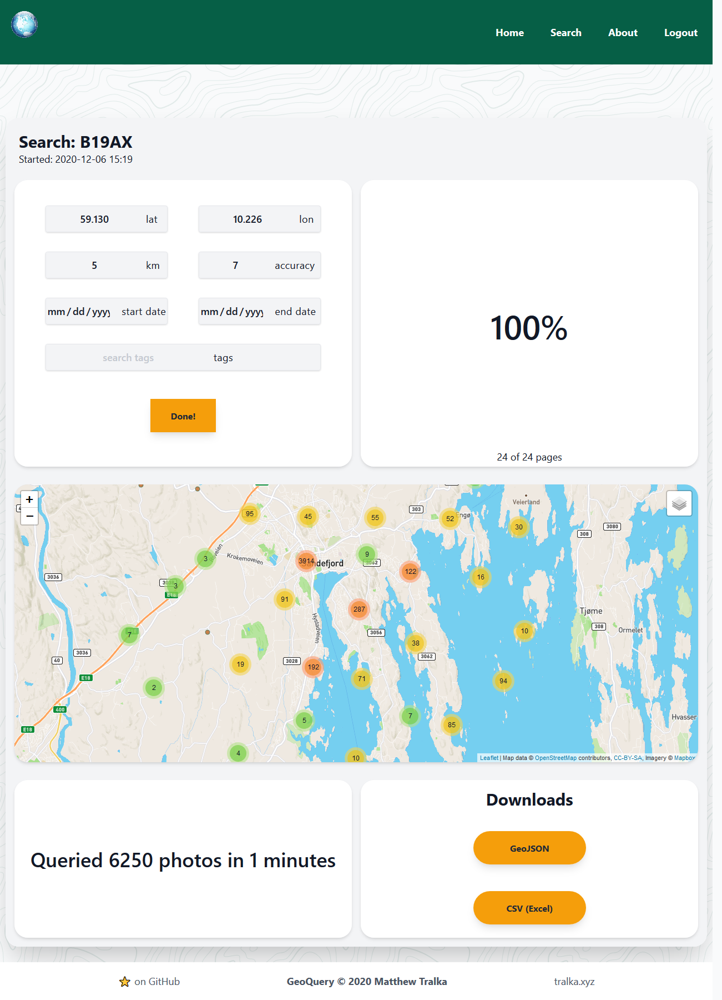
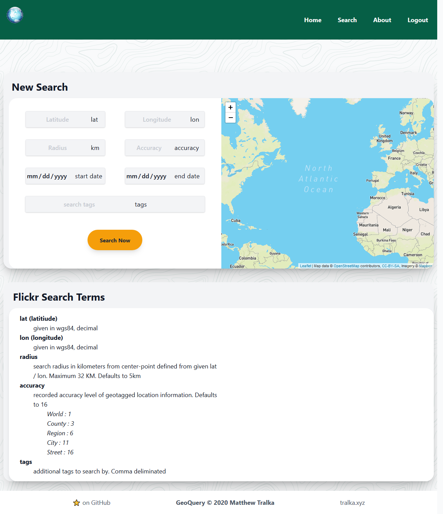

# :earth_americas: GeoQuery

## *Search, Know, Change*

  [](https://github.com/psf/black) <br/>
[](https://www.python.org/)  [](https://shields.io/)

#### **Objective**

 GeoQuery aims to address the global data equity issue. To do this, GeoQuery will serve as an online platform to facilitate cross-service spatio-temporal searches and analysis. This will empower communities of all technical backgrounds to easily interact with and leverage real-world datasets.

#### Project Status

 Currently, GeoQuery is in an early Beta mode with active Flickr integration and a solid codebase. Addition of further API's to come.

**Task**|**Description**|**Status**|**Finished**
:-----:|:-----:|:-----:|:-----:
FB Integration| |not started| :heavy_minus_sign:
Twitter Integration| |not started| :heavy_minus_sign:
about page| |in progress| :soon:
scheduled searches | |not started| :heavy_minus_sign:
email alerts | |not started| :heavy_minus_sign:
task searchbar | |not started| :heavy_minus_sign:


#### Examples

*Current as of 12/6 - subject to change*

- [CSV results](example/exampleCSV.csv)
- [GeoJSON results](example/exampleGeoJSON.geojson)

 <a href="url"></a><br/>
*status of results page*

 <a href="url"></a><br/>
 *status of search page*

#### How to Cite

I created this program for academic research purposes. If you use GeoQuery for your own academic purposes, please attribute your usage something like this:

```
Tralka Matthew. 2020. GeoQuery. Retrieved from https://github.com/mtralka/GeoQuery
```

#### Disclaimer

GeoQuery is, and will always be, open source and for academic use only. GeoQuery is not related to, or endorsed by, any company featured on or in the above source code and documentation. GeoQuery gathers and distributes data in full compliance with our implemented API's fair-use policies.


*this ReadMe is a work in progress. Please check back soon or contact me for more information.*